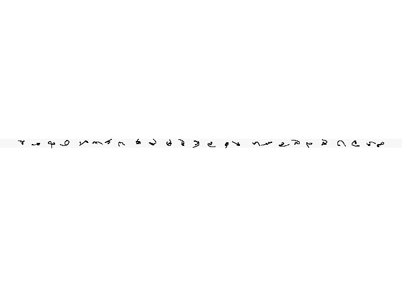
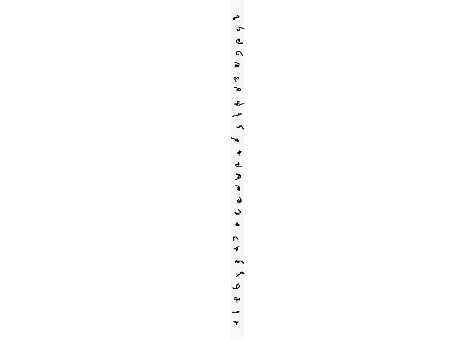
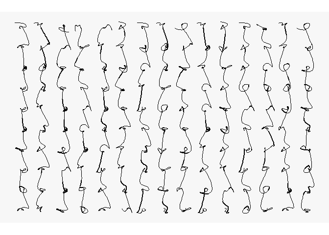

R Notebook
================

<!-- README.md is generated from README.Rmd. Please edit that file -->

# asemic-writing

I have been curious about asemic writing for some time. In this notebook
I adapt the code of Georgios Karamanis to create asemic glyphs: check
<https://github.com/gkaramanis/aRtist/blob/main/asemic/asemic.R>

Only two packages are needed:

``` r
library(tidyverse) # Easily Install and Load the 'Tidyverse'
#> Warning: package 'tidyverse' was built under R version 4.4.2
#> Warning: package 'readr' was built under R version 4.4.2
#> Warning: package 'forcats' was built under R version 4.4.2
#> ── Attaching core tidyverse packages ──────────────────────── tidyverse 2.0.0 ──
#> ✔ dplyr     1.1.4     ✔ readr     2.1.5
#> ✔ forcats   1.0.0     ✔ stringr   1.5.1
#> ✔ ggplot2   3.5.1     ✔ tibble    3.2.1
#> ✔ lubridate 1.9.3     ✔ tidyr     1.3.1
#> ✔ purrr     1.0.2     
#> ── Conflicts ────────────────────────────────────────── tidyverse_conflicts() ──
#> ✖ dplyr::filter() masks stats::filter()
#> ✖ dplyr::lag()    masks stats::lag()
#> ℹ Use the conflicted package (<http://conflicted.r-lib.org/>) to force all conflicts to become errors
```

``` r
library(ggforce) # Accelerating 'ggplot2'
#> Warning: package 'ggforce' was built under R version 4.4.2
```

Set the parameters for creating the glyphs, that is, the number of
glyphs (corresponding to letters), the number of points to generate each
glyph (used by the splines function), and the cutoff for the thickness
of the lines:

``` r
seed <- sample.int(1000000, 1)
set.seed(seed)

l <- letters
nl <- length(l) # Number of letters
s <- sample.int(8, 1) + 2 # Points per letter
z <- runif(1, 0, 0.5) # Thickness of strokes
```

``` r
# Initialize a data frame with all letters
flo <- data.frame(letter = l) |> 
  # Group by row
  rowwise() |> 
  # Mutate rows with a list of values to generate random points for the glyphs
  mutate(
    a = list(runif(s, 0, 2 * pi)),
    rx = list(1 + seq(0.1, 0.5, length.out = s) * cos(a)),
    ry = list(1 + seq(0.1, 0.3, length.out = s) * sin(a))
    ) |> 
  # Ungroup and unnest
  ungroup() |> 
  unnest(c(rx, ry)) |> 
  # Group by row again
  rowwise() |> 
  # Mutate for thickness
  mutate(
    # Thickness of strokes
    size = runif(1, 0, 2),
    size = if_else(size < z, 0, size)) |> 
  ungroup() |>
  # Give each asemic character a letter
  mutate(letter = rep(l, each = s))
```

Plot letter a single letter:

``` r
flo |> 
  filter(letter == "a") |>
  ggplot(aes(x = rx, 
             y = ry, 
             group = letter,
             size = size)) +
  geom_bspline2(n = 800, lineend = "round") +
  scale_size_continuous(range = c(0, 0.8)) +
  coord_fixed() +
  theme_void() +
  theme(
    legend.position = "none",
    plot.background = element_rect(fill = "grey97", color = NA)
  )
#> Warning: Using `size` aesthetic for lines was deprecated in ggplot2 3.4.0.
#> ℹ Please use `linewidth` instead.
#> This warning is displayed once every 8 hours.
#> Call `lifecycle::last_lifecycle_warnings()` to see where this warning was
#> generated.
```

<!-- -->

Plot all characters in a single row:

``` r
flo |> 
  mutate(x = rep(1:length(l), 
                 each = s),
         rx = x + rx) |>
  ggplot(aes(x = rx, 
             y = ry, 
             group = x,
             size = size)) +
  geom_bspline2(n = 800, lineend = "round") +
  scale_size_continuous(range = c(0, 0.8)) +
  coord_fixed() +
  theme_void() +
  theme(
    legend.position = "none",
    plot.background = element_rect(fill = "grey97", color = NA)
  )
```

<!-- -->

Plot all characters in a single column:

``` r
flo |> 
  mutate(y = rep(1:length(l), 
                 each = s),
         ry = y + ry) |>
  ggplot(aes(x = rx, 
             y = ry, 
             group = letter,
             size = size)) +
  geom_bspline2(n = 800, lineend = "round") +
  scale_size_continuous(range = c(0, 0.8)) +
  coord_fixed() +
  theme_void() +
  theme(
    legend.position = "none",
    plot.background = element_rect(fill = "grey97", color = NA)
  )
```

<!-- -->

Create random text:

``` r
nr <- 10 # Number of rows
nc <- 15 # Number of columns

# Generate a grid for the block of text with y rows and x columns
atext <- expand.grid(x = 1:nc, 
                     y = 1:nr) |>
  # Randomly assign letters
  mutate(letter = sample(letters, 
                         n(), 
                         replace = TRUE))
```

Join asemic characters to text:

``` r
atext_bd <- data.frame()
for(i in 1:nrow(atext)){
  atext_bd <- rbind(atext_bd,
                data.frame(
                  flo |> 
                    filter(letter == atext$letter[i]),
                  x = atext$x[i],
                  y = atext$y[i]))
  }

atext_bd <- atext_bd |>
  # Adjust the values of the points rx and ry by their position in the block of text (row and column)
  mutate(rx = rx + x, 
         ry = ry + y)
```

Plot the text while grouping by column to create the impression of
top-bottom writing:

``` r
ggplot(atext_bd, 
       aes(x = rx, 
           y = ry, 
           group = x, 
           size = size)) +
  # geom_point(color = "pink") +
  geom_bspline2(n = 800, lineend = "round") +
  scale_size_continuous(range = c(0, 0.8)) +
  coord_fixed() +
  theme_void() +
  theme(
    legend.position = "none",
    plot.background = element_rect(fill = "grey97", color = NA)
  )
```

<!-- -->

Plot the text while grouping by row to create the impression of
right-left writing:

``` r
ggplot(atext_bd, 
       aes(x = rx, 
           y = ry, 
           group = y, 
           size = size)) +
  # geom_point(color = "pink") +
  geom_bspline2(n = 800, lineend = "round") +
  scale_size_continuous(range = c(0, 0.8)) +
  coord_fixed() +
  theme_void() +
  theme(
    legend.position = "none",
    plot.background = element_rect(fill = "grey97", color = NA)
  )
```

<!-- -->
